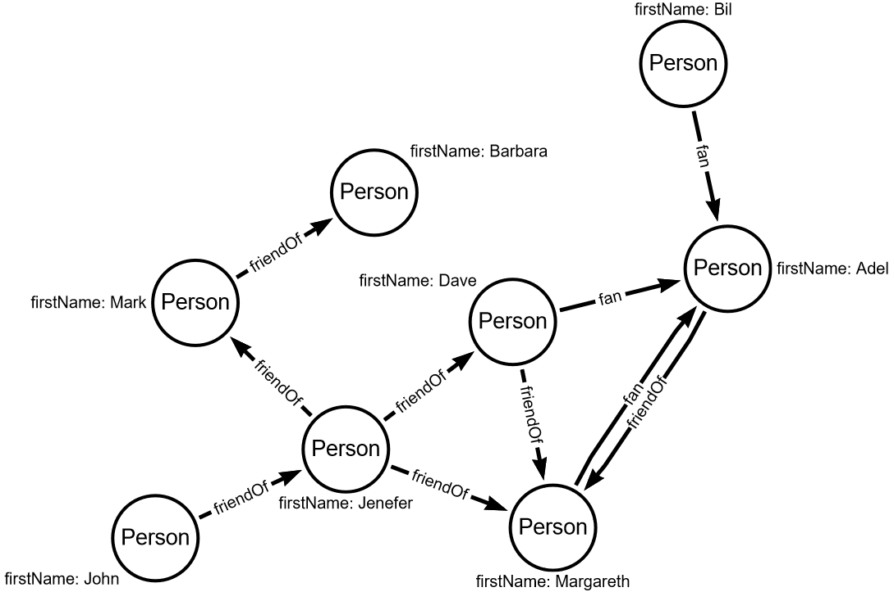

# Task 0 - Introduction

Graph databases work best when there are many dependencies and relationships between the data.
Therefore, the edges in the graph databases are the first class citizen.

Let's expand our graph with a few more objects and add relations between them.
The diagram below shows the graph we will work on in this lesson.

The diagram below shows the updated data graph.

I add more persons to the graph and two relation types: `friendOf` and `fan`.

In a graph, all edges have to have a direction.
In the case of a friendOf relationship, this is not natural - friendship is rather bidirectional.
In such a situation, when modeling the graph, the direction of the relationship does not matter, 
and you should remember about it when traversing. 

Click `Check` and go to your first task.
