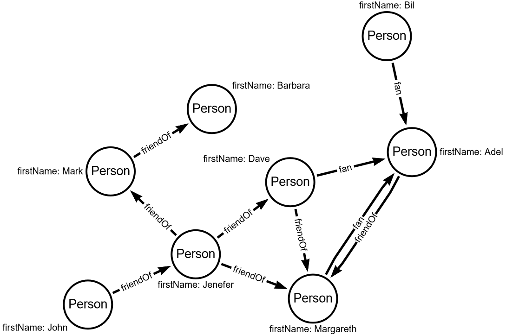

# Find friends of friends with loop

In the previous task, you write a function that returns friends of friends.
Now we will refactor that function and reducing code duplication.

Gremlin provides loops by `repeat` step.
`repeat` takes nested traverse as an argument, e.g.

```text
g.V()
    .repeat(
        both('friendOf')
    )
    .times(2)
    .dedup()
    .values('firstName')
```

The code above is the pure gremlin query which can be passed to gremlin console.

Write a kotlin code that returns all friends names using a loop based on the above example.
Deep of friends searching is configured by the function `n` parameter.

In the `repeat` function, you have to import `org.apache.tinkerpop.gremlin.process.traversal.dsl.graph.__` and use it an anonymous GraphTraversal.
Underscore is a special character in kotlin and you have to alias it.

## The graph diagram for this task

