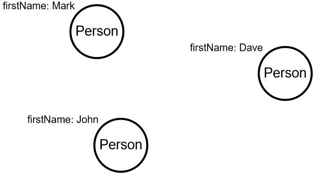

# Welcome

Welcome to my Graph Database Course.

## What you will learn

In this course, you will learn

- How to use [Gremlin](https://tinkerpop.apache.org/gremlin.html) query language to fetch graph database
- How to update graph data with [Gremlin](https://tinkerpop.apache.org/gremlin.html)
- How to design a graph

## Before we start

This course is driven by IntelliJ IDEA Edu.
You can read more about this platform at the [jetbrains.com](https://www.jetbrains.com/help/idea/product-educational-tools.html) site.

In each task, I provide links to documentation and tips so that you have a starting point when you get stuck.

## Technology

There are two popular languages for graph databases:
[Cypher](https://neo4j.com/developer/cypher/) and [Gremlin](https://tinkerpop.apache.org/gremlin.html).
I decided to use Gremlin because:

- All popular graph databases support it
- A query can be map one-to-one to the code (java, kotlin, typescript) so that our queries can be verified at the compilation stage

In this course, I use an in-memory graph database.
The key is to learn how to work with data graphs.

If you decide to start a production project, you will have to choose the right vendor.
Each vendor may differ on things such as support transactions, support distributed servers, indexing, etc.

## Graph and Gremlin basics

Gremlin is the graph traversal language.
Every Gremlin traversal is composed of a sequence of (potentially nested) steps.
The sequence has to start from the graph traversal source witch is typically assigned to the `g` variable, e.g.
```
println g       // GraphTraversalSource
    .V()        // Spawns a GraphTraversal starting with all vertices
    .count()    // Map the traversal stream to its reduction as a sum
    .next()     // Returns the next element in the iteration.
```
The above piece of code will print the number of entities in the database.

## Data graph for lesson 1

The diagram below shows the sample data graph we will use in lesson 1.
This is a very simple graph containing only three unconnected vertices (also called nodes).
They are all of type `Person` and have the property `firstName`.



Click `Check` and go to your first task.
