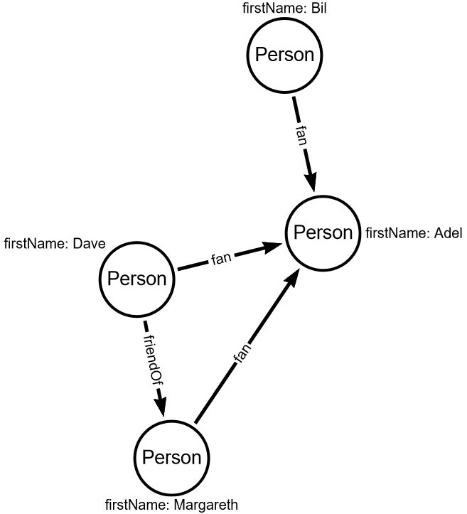
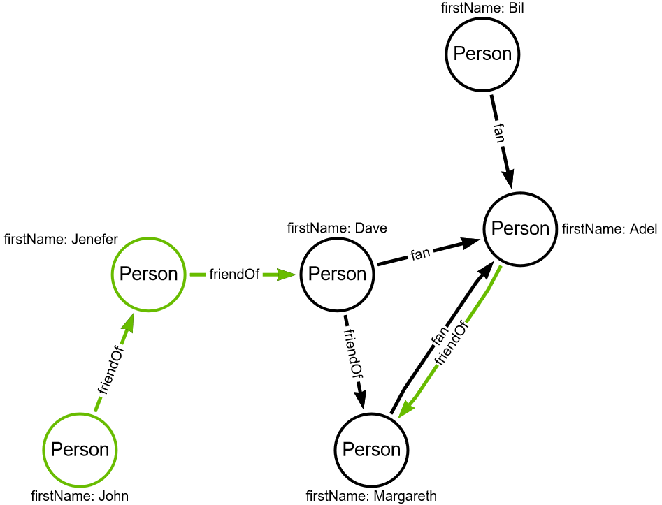

# Add vertices and edges

So far, we've only been reading data from a graph.
Now it's time to start modifying the graph.

Write the function which adds vertices and edges to the graph to transform input graph to output graph presented below.

Adding vertices is quite simple, just use `addV` method.

To set properties use `property` method.

Gremlin queries are lazy evaluated. You have to fetch results (e.g. calling `next` method) to trigger evaluation.

To add an edge, you have to provide start and end vertices.
As I mention it path finding task, regular gremlin traversing don't keep traversing history (for performance reasons).
For this reason, it is necessary to force the save result of finding vertex step so that in the step of adding the edge you have references to both vertices.
Check out the `addEdge` function and use it to add required edges.

## Input graph

## Expected output graph
Elements that should be added are marked in green.

