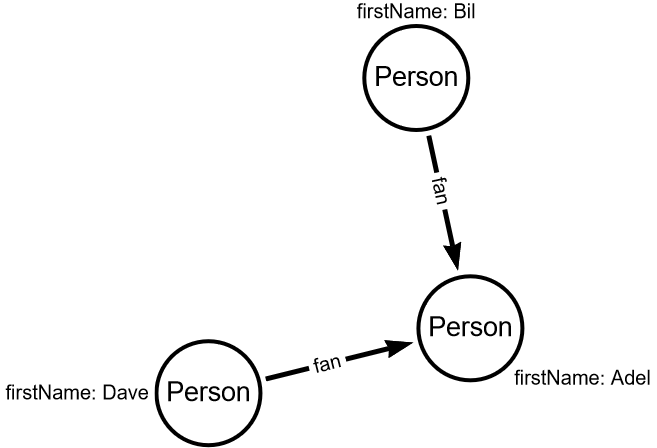

# Delete vertices

Write code to delete edge between Dave as Adel.

To delete the edge you have to find the vertex and specify which node you want to delete.

Read drop method documentation.

## Input graph

## Expected output graph

