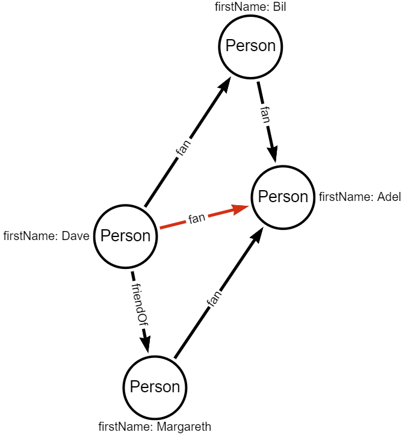
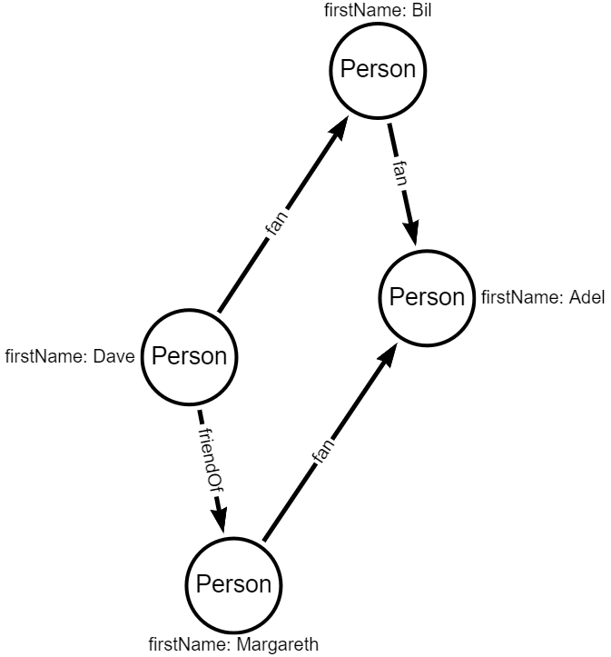

# Delete vertices

Write code to delete edge between Dave as Adel.

Try to use `where` method.

To delete the edge you have to find the vertex and specify which node you want to delete.

## Input graph
Elements that should be deleted are marked in red.

## Expected output graph

