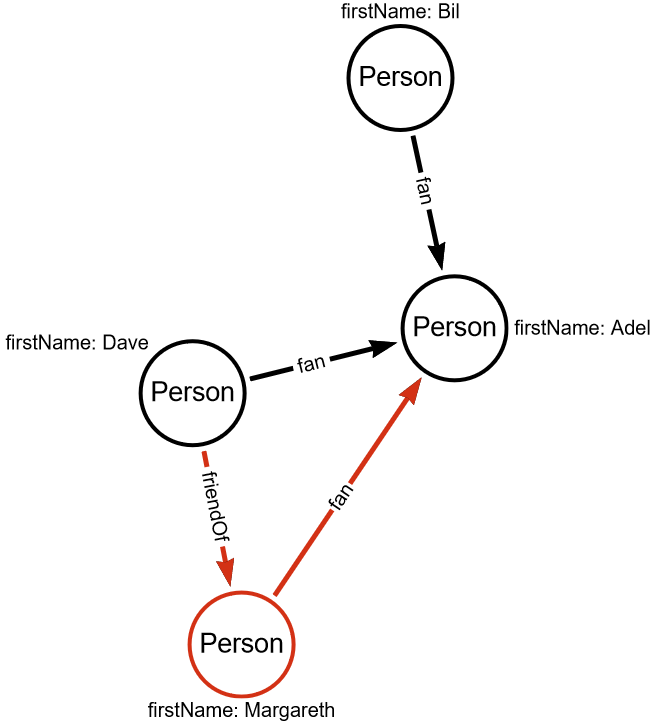

# Delete vertex

Write code to delete Margareth vertex.

Read `drop` method documentation <a href="http://tinkerpop.apache.org/javadocs/3.4.1/core/org/apache/tinkerpop/gremlin/process/traversal/dsl/graph/GraphTraversal.html#drop--">GraphTraversal.html</a>.

When you delete vertex, gremlin automatically delete associated edges.

Gremlin queries are lazy evaluated.

## Input graph
Elements that should be deleted are marked in red.

## Expected output graph

