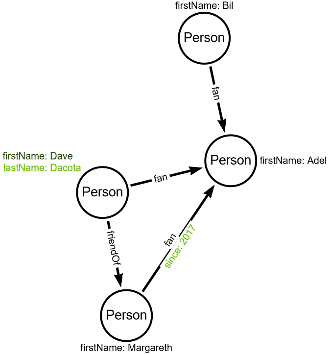

# Update vertices and edges

Write code to add `lastName` property to value `Dacota` to person with first name equal to `Dave`.
Then add `since` property of type `Int` and with value `2017` to `fan` edge between Margareth and Adel.

When you delete vertex, gremlin automatically delete associated edges.

## Input graph

## Expected output graph
Elements that should be added are marked in green.

